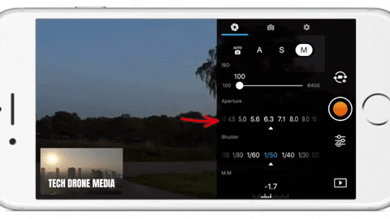
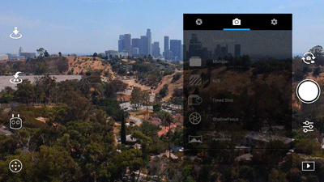

# How to Set Your Settings For Good Media Cinematography {#ch-camera-settings}

## Three Rules for Getting the Best Drone Pictures
1. Understand The Settings within a Drone 
2. Make sure your settings are a lined with the Weather 
3. Make Sure you always double check your shots after shooting 

## Settings

### Camera Settings
#### Iso 
 ISO measures the sensitivity of the image sensor. The lower the number the less sensitive your camera is to light and the finer the grain. By choosing a higher ISO you can use a faster shutter speed to freeze the movement. Higher numbers mean your sensor becomes more sensitive to light which allows you to use your camera in darker situations, but the cost of doing so is more grain.


#### Shutter Speed 
The Shutter controls for how long light is let into the lenses. To simplify the shutter, a low shutter speed lets more light in and is good for taking pictures in dim lighting while a high shutter speed lets in more light and is good for taking crisp shots of moving objects or people. In S mode, you can set the shutter speed, but other settings will be set automatically to match exposure.


#### Aperature
This controls how much light gets through when you take a picture. This is measured in ‘f-stops.’ A smaller f-stop number means a bigger aperture and so more light comes through, and a bigger f-stop number means a smaller aperture, so less light comes through. In A mode, you can set the Aperture, but other settings will still be set automatically to match exposure.

```{r,echo=FALSE, out.width='75%', fig.asp=.75, fig.align='center'}

```

### Photo Settings

#### Single Shot 
The standard mode, it takes a 1 picture every time you tap the shoot button.

#### HDR Shot
The camera will take three images of the same scene. One will be underexposed, another overexposed and the last will be properly exposed then it will combine the three images to create a more dynamic JPEG. 

#### Multiple
With this mode, the camera will take multiple pictures when you press the shoot button. You might want to use this mode if you are trying to get a shot of a moving subject.

#### AEB (Automatic Exposure Bracketing)
A set of 3 or 5 shots that work similarly to HDR Shots taking overexposed, underexposed and properly exposed photos. However, in AEB the images are in RAW and they are not combine. 

#### Timed Shot 
This allows you to set a countdown timer before the shot is taken, it’s useful for taking selfies.

#### Pano 
180° Panorama mode  can stitch 21 photos together to create a 180° panoramic photo.

```{r,echo=FALSE, out.width='75%', fig.asp=.75, fig.align='center'}

```

#### ShallowFocus
This mode allows you to create a depth of field effect in your photo.

### Other Settings 

#### Image Size 
You can choose the size of your picture 4:3,16:9 3:2. 4:3 was the old standard 33mm size. 16:9 is the common size for HD capable devices and 3:2 is the traditional size for printed photos.

#### Image Format
In this area, you can choose between taking photos in RAW, JPEG and RAW + JPEG. Raw is a file format that captures all image data recorded by the sensor when you take a photo. JPEG a format for compressing image files.

#### White Balance 
This is the process of removing unrealistic color casts so that objects which appear white in person are rendered white in your photo.  It is measured in Kelvins. If you have Auto selected, then the camera will decide what the best setting is. You can also choose from a selection of profiles or set it yourself. Kelvin Temperature is simply a unit of measurement for temperature and in photography we most often use it to measure the color temperature of light sources. The temperature scale most often used in photography ranges from about 2000K (K=Kelvin) to 9000K.

```{r,echo=FALSE, out.width='75%', fig.asp=.75, fig.align='center'}
  knitr::include_graphics('images/white_balance.gif')
```

#### Style 
This is where you can configure the sharpness, contrast, and saturation of the images or videos that your drone’s camera takes. (Triangle) Digital Sharpness this makes the picture sharper. (Circle) Contrast controls the strength of the lights and the darks in the picture. (Rectangle) Saturation of colors low saturation makes the photos look dull, and high saturation make the colors pop. These can be set in a range of -3 to +3.

#### Color 
Here you can set the camera color profile. These settings affect the colors in your photo.  D – Cinelike and D –Log are both designed for taking photos that will be post-processed later on. The rest of the color profiles are ready to go with no post-processing required.


## Weather Considerations

###  Cloudy and Overcast Days 
A cloudy and Overcast day gives an amazing amount of diffused light. You can also shoot in the middle of the day with little worry about harsh lighting or unwanted shadows. Theres a catch though when shooting scenary feel in overcast conditions can also be challenging. Overcast skies are gray and don’t usually add a lot of interest to that mountainscape, or field of cows you want to photograph. Look for stormy weather clouds, that add a sense of place and dimension. You can also crop your shot so that you don’t get those unwanted gray skies, but still get great lighting. This means you will be shooting with the lower side of the settings like lower aperature, ISO, and Shutter Speed.

### Sunny Days 
Landscapes in bright sun are absolutely beautiful. Try shooting the beach in the full sun of the day usually around 1 or 2pm. Practice exposing for the beautiful blue skies as well as the sand. Make sure you have high aperature, ISO, and Shutterspeed to keep your shots from being over exposed. Of course this is always mannual correction when editing, but you want to take photos that need little to none editing when shooting. 


## Practice 
 Make sure you are always going back to shots and making sure they what you had in mind with the settings and the feel you are going for. You do not want to take a shot and then just think it was good enough, I always like to have about 4-6 shots with different settings and different feels. The reason being is that its always better to have opitions, because sometimes what you get out and about does not look the same when your uploading.
